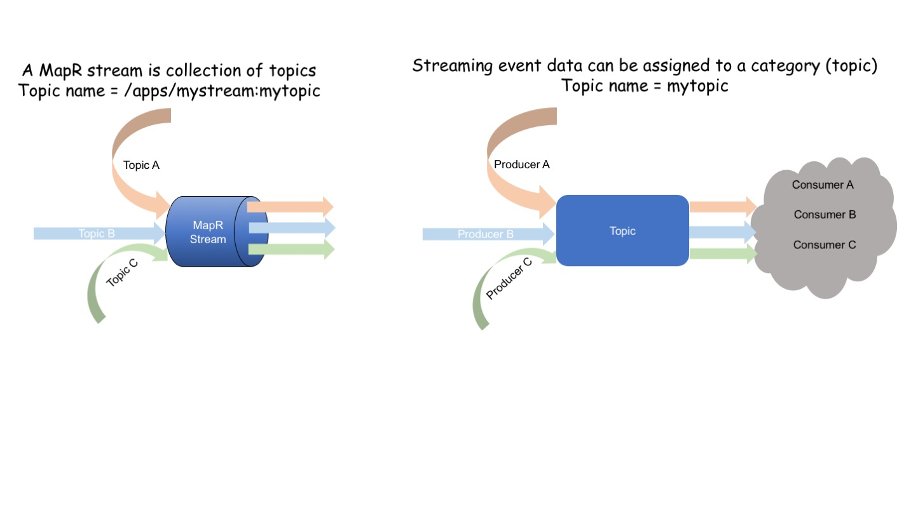
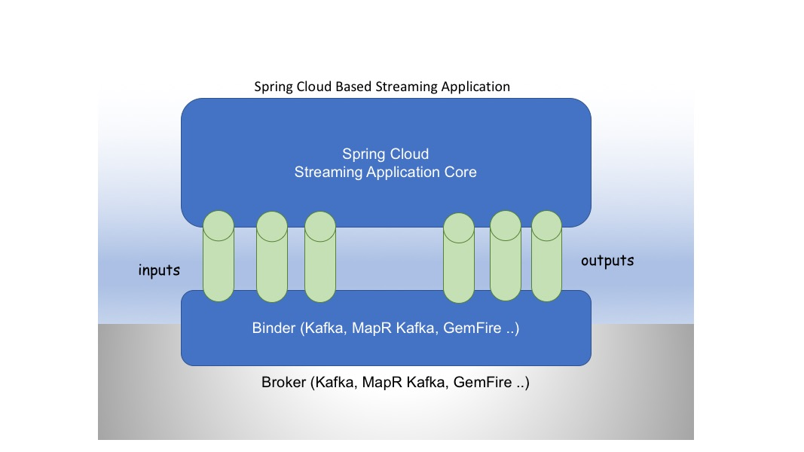
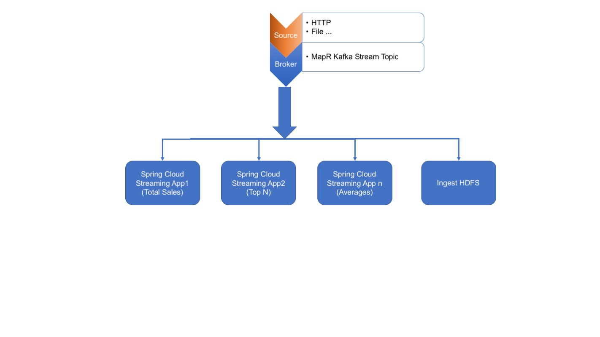
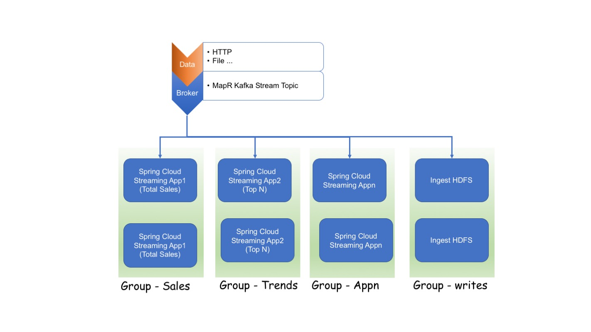
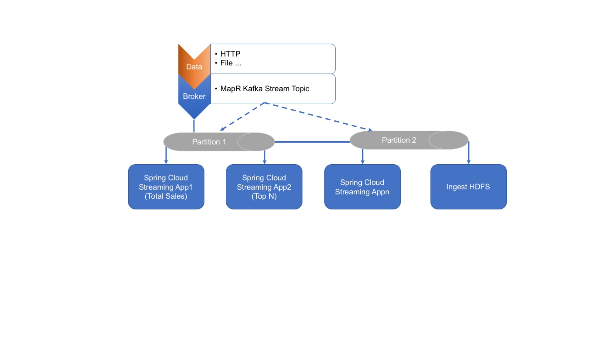

## Spring Cloud Stream Application Using MapR Stream Topics

[MapR (6.1)](https://mapr.com/blog/mapr-6-1-simplifies-the-development-of-ai-and-analytics-applications/)  latest 
release provides support for Kafka Streams (eg KStream, KTable etc)

For a developer/architect,nothing more enthralling than trying out disruptive latest technology like MapR.

MapR-ES provides cutting edge streaming capabilities which is [highly performanant & scalable](https://mapr.com/blog/kafka-vs-mapr-streams-why-mapr/) 
as compared to Apache kafka. 

As a developer/architect, I would like to build streaming application which is agnostic of broker 
(MapR Stream, Kafka ...) and simple programing model. Spring Cloud Stream has cracked the problem of being broker agnostic
and provides a simple programing model, which let's developer concentrate on functionality.

I would say,reading documentation atleast, MapR Stream and Spring Cloud Stream combination - **_"A match made in heaven!!!"_** 

**_MapR Stream + Spring Cloud Stream = Developer productivity = High Performance & Scalability_**

Since products/fuctionalities are not build with diagrams & documentations, I started building MapR based streaming application using Spring Cloud Stream, I ran into trouble because
in Kafka a topic is just an alphanumeric but in MapR a stream is a collection of topics and each topic name is 
prefixed with path to the stream.

 

Hmm... I am struck. Does this means MapR Stream + Spring Cloud Stream will not work. The answer is NO.

Check out my project in Github -> [spring-cloud-kafka-twitter](https://github.com/mgorav/SpringCloudKafkaStreamTwitterTrend), which demonstrates:
1. Integrate Spring Cloud Stream & MapR Stream topic(s) with zero boilerplate code
2. Broker (MapR Stream) agnostic streaming application
3. KStream , KTable (MapR Kafka Stream 1.1)
4. Simplified Programing model - Source, Sink & Processor
5. ..

## Overview 
Apache Kafka is the market standard for event streaming. MapR-ES provides support Kafka streaming APIs and  
took it to next level by extending it with:
- better storage
- replication
- security ...

A Spring Cloud Stream application is made using broker-agnostic core. What does this mean? Application communicates 
through notion of input and output channels injected into it by Spring Cloud Stream. Further, channels are connected to 
external brokers using middleware-specific Binders implementations.

 

Below are my notes, while learning Spring Cloud Stream.

 ### Spring Cloud Stream Key Features  
    
 1. **Fat Jar**
 
    Spring cloud application can be run as fat jar or from ide or as typical spring boot Application
 
 2. **Pub-Sub**
 
    The communication between applications follow pub-sub model i.e. data is broadcasted through topics
    
    
 3. **Consumer Group**
 
    To avoid  competing consumer relationship problem, Spring CLoud borrowed consumer group concept from Kafka, this means, 
    All groups which subscribe to a given destination receive a copy of published data, but only one member of each group 
    receives a given message from that destination.
    
         
 4. **Durability** 
  
    Consumer group subscriptions are durable i.e. a binder implementation ensures that group subscriptions 
    are persistent, and once at least one subscription for a group has been created, the group will receive messages,
     even if they are sent while all applications in the group are stopped.
     
 5. **Partitioning**
 
    This feature provides abilitty to partition data between multiple instances of a given application and
    provides performance boost specially for stateful processing, ensuring related data is processed together. Using 
    partitioning, the communication medium (broker, topics ..) is viewed as being structurally split into multiple
    partitions. This means multiple producer applications send data to multiple consumer ensuring related (common) data
    characteristics are processed together in the same consumer instance.
    

3. **Message**

   The canonical data structure abstraction used by producers and consumers to communicate with Destination Binders 
   (and thus other applications via external messaging systems).
   

## Spring Cloud Stream Core Concepts
1. **Destination Binders**

    _An abstraction responsible for providing integration with the external messaging systems._
    ```java
    
    @Component
    public static class TweetMessageSink {

        @StreamListener
        @SendTo(TWEET_MSG_COUNTS_OUT)
        public KStream<String, Long> process(@Input(TWEET_MSG_IN) KStream<String, TweetMessage> events) {
            return events
                    .map((key, value) -> {
                        return new KeyValue<>(value.getText(), "blah");
                    })
                    .groupByKey()
                    .count(Materialized.as(TWEET_MSG_COUNTS_MV))
                    .toStream();

        }
    }

    ```
    
2. **Destination Bindings**

    _An abstraction, which bridges gap between the external messaging systems and application provided Producers and 
    Consumers of messages (created by the Destination Binders) eg @EnableBinding.
    This annotation can take one or more interface classes as parameters. The parameters are referred to as bindings, 
    and they contain methods representing bindable components. These components are typically message channels 
    for channel-based binders (such as MapR Stream, Kafka, and others). However other types of bindings can provide 
    support for the native features of the corresponding technology. For example MapR Stream ,Kafka Streams binder_ 
    
    ```java
       @EnableBinding(TweetMessageBinding.class)
       @SpringBootApplication
       @Slf4j
       public class TwitterTrendApplication {
    
       }
    ```
   
  
## Spring Cloud Stream Programing Model
  
  The message exchange contracts is specified in binding interface, which includes: 
  
  1. _**Sink <<< CONSUMER**_
        Identifies the contract for the message consumer by providing the destination from which the message is consumed.
          
        _**NOTE**_ 
        
        _Consumer types available:_
        
        a) Asynchronous - Message Driven
        
        b) Polled - Synchronous
              
  2. _**Source <<< PRODUCER**_
        Identifies the contract for the message producer by providing the destination to which the produced message is sent.
      
  3. _**Processor**_
        Encapsulates both the sink and the source contracts by exposing two destinations that allow consumption and 
        production of messages.
   
     ```java
     interface TweetMessageBinding {
     
         String TWEET_MSG_OUT = "tweetmsgout";
         String TWEET_MSG_IN = "tweetmsgin";
     
         String TWEET_MSG_COUNTS_OUT = "tweetmsgcntout";
         String TWEET_MSG_COUNTS_IN = "tweetmsgcntin";
         String TWEET_MSG_COUNTS_MV = "tweetmsgmv";
     
         @Input(TWEET_MSG_COUNTS_IN)
         KTable<String, Long> pageCountsIn();
     
         @Output(TWEET_MSG_COUNTS_OUT)
         KStream<String, Long> pageCountOut();
     
         @Output(TWEET_MSG_OUT)
         MessageChannel tweetMessageEventsOut();
     
         @Input(TWEET_MSG_IN)
         KStream<String, TweetMessage> tweetMessageEventsIn();
     }
     ```    
    
   
## Pre-requisite

This project uses latest MapR sanbox 6.1. To install MapR follow steps specified in project - [SpringBootMapR](https://github.com/mgorav/SpringBootMapR)

To install MapR Kafka issue following commands in the MapR sandbox docker container:

```bash

apt-get install mapr-kafka

/opt/mapr/server/configure.sh -R

## Go to MapR Kafka 

root@maprdemo:/opt/mapr/kafka/kafka-1.0.1/config#vi server.properties
advertised.host.name=maprdemo
advertised.port=9092
zookeeper.connect=localhost:5181

## Start MapR Kafka

root@maprdemo:/opt/mapr/kafka/kafka-1.0.1/bin# ./kafka-server-start.sh  ../config/server.properties

```

## Play time
  Run the application as spring boot application & observer the logs.


 